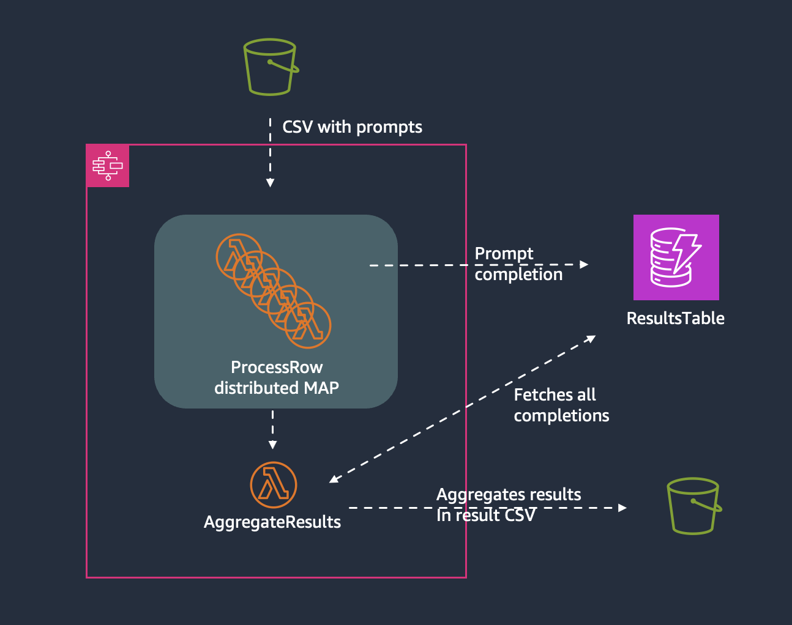

# Manual bedrock invoke batch



Step function workflow that takes a csv on the shape

```csv
prompt_id, prompt
1, "Write a haiku for coffee."
2, "Write instructions for dancing in the dark."
```

and runs n Lambda functions in parallel, with a single row from the csv as input to each Lambda, all using the Bedrock invoke_model API with the provided prompt. Each result is written to a DynamoDB table, and when the entire csv has been processed, another Lambda function retreives all results from DDB and creates a new csv, uploading it to S3.

This structure used in S3:

```
s3://your-bucket/
  jobs/
    test-job-2024-03-21-15-30-00/
      input/
        prompts.csv
      output/
        results.csv
```

> [!NOTE]  
> By default, this template ensures all data in S3 is deleted after 3 day, and each item in DDB after 2 days. This is only for cost control.

> [!WARNING]  
> This sample, if used without carefully considering concurrency, may greatly impact the consumed Bedrock invoke_model on demand quotas in the AWS account where it's run. If there are other applications relying on Bedrock in this AWS account, ensure you use a different region for this (Bedrock quota is regional).

## Prerequisites

- [AWS CLI](https://docs.aws.amazon.com/cli/latest/userguide/getting-started-install.html) installed. This is used for uploading data to s3 and deploying cloudformatio.
- [AWS SAM CLI](https://docs.aws.amazon.com/serverless-application-model/latest/developerguide/install-sam-cli.html) installed. This is a convencience CLI, simplifying building and deploying cloudformation.
- Active AWS credentials in current environment

## Setup

0. Decide on concurrency

Given the type of prompts and model used, you need to set a maximum concurrency that makes sense. This will determine how many lambda functions that run in parallel. If a lambda function is throttled, there's an automatic retry after 20 seconds, with a back-off rate multipler of 2. A request is retried at most 5 times by default.

Given your character of your prompt, choose a concurrency that makes sense. Edit the `MaxConcurrency` in the [the Statemachine definition](statemachine/definition.asl.yaml) to what makes sense for you.

0. Decide on Model

Update the model ARN in the [process prompt Lambda function](process_prompt/app.py). Default implementation assumed Anthropic model.

0. Choose AWS region

Update region variable in the [makefile](./makefile)

## Usage

0. See available commands.

There are several pre-baked commands to simplify logging, hot-reloading changes directly to the Lambda functions, running the workflow etc. For a list of available commands, run

```bash
make
```

at the root of this repo.

1. Deploy the Stepfunction workflow

```bash
make go
```

2. Submit "batch job"

```bash
make run-workflow INPUT=path/to/file.csv NAME=mytestjob
```

To use the provided test csv, run

```bash
make run-workflow INPUT=test.csv NAME=simpletestjob1
```

## Tips

- In the region you're using Bedrock, there's an automatic dashboard created in Cloudwatch where you can track number of input/output tokens, number of invocations, throttled requests etc, per model. Use it!
